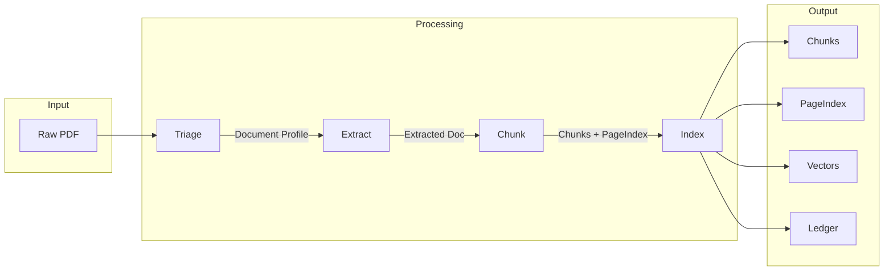
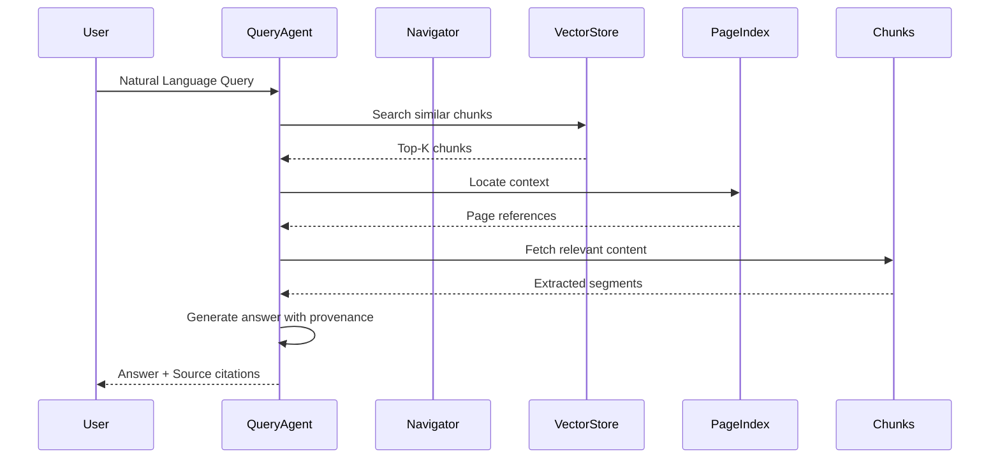

# Document Intelligence Refinery - Architecture

## System Overview

The Document Intelligence Refinery is a 5-stage pipeline for intelligent document processing, designed to handle diverse document types from Ethiopian government and corporate sectors.

```
┌────────────────────────────────────────────────────────────────────────────────┐
│                        DOCUMENT INTELLIGENCE REFINERY                          │
│                           5-Stage Pipeline Architecture                       │
└────────────────────────────────────────────────────────────────────────────────┘
```

## Stage Overview

| Stage | Name | Purpose | Key Components |
|-------|------|---------|----------------|
| 1 | **Triage & Profiling** | Analyze and classify documents | TriageAgent, DocumentProfiler |
| 2 | **Strategy Routing** | Route to appropriate extraction method | StrategyRouter, DocumentClassifier |
| 3 | **Extraction Engine** | Extract content using selected strategy | FastText, MineruLayout, Vision strategies |
| 4 | **Semantic Chunking** | Segment and index content | ChunkingEngine, LayoutChunker, PageIndex |
| 5 | **Output & Storage** | Store results and prepare for queries | VectorStore, Ledger, IndexBuilder |

---

## Full Pipeline Architecture

```mermaid
flowchart TB
    subgraph Input["INPUT LAYER"]
        PDF_DOC[("PDF Document")]
        SCAN_DOC[("Scanned Document")]
        IMG_DOC[("Image Document")]
    end

    subgraph Stage1["STAGE 1: TRIAGE & PROFILING"]
        direction TB
        PDF_PARSER["PDF Parser"]
        METADATA_EXT["Metadata Extractor"]
        TEXT_ANALYZER["Text Layer Analyzer"]
        IMG_QUALITY["Image Quality Analyzer"]
        
        TRIAGE_AGENT["Triage Agent"]
        DOC_CLASS[("Document Class")]
        DOC_PROFILE[("Document Profile")]
        
        PDF_PARSER --> TRIAGE_AGENT
        METADATA_EXT --> TRIAGE_AGENT
        TEXT_ANALYZER --> TRIAGE_AGENT
        IMG_QUALITY --> TRIAGE_AGENT
        
        TRIAGE_AGENT --> DOC_CLASS
        TRIAGE_AGENT --> DOC_PROFILE
    end

    subgraph Stage2["STAGE 2: STRATEGY ROUTING"]
        ROUTER["Strategy Router"]
        STRAT_SELECT{("Select Strategy")}
        
        STRAT_A["Strategy A: Fast Text"]
        STRAT_B["Strategy B: Mineru Layout"]
        STRAT_C["Strategy C: Vision Model"]
        
        ROUTER --> STRAT_SELECT
        STRAT_SELECT -->|Native + Simple| STRAT_A
        STRAT_SELECT -->|Native + Complex| STRAT_B
        STRAT_SELECT -->|Scanned/Complex| STRAT_C
    end

    subgraph Stage3["STAGE 3: EXTRACTION ENGINE"]
        EXTRACTOR["Extractor Agent"]
        
        FAST_TEXT["FastText Strategy"]
        MINERU["MineruLayout Strategy"]
        VISION["Vision Strategy"]
        
        VALIDATOR["Chunk Validator"]
        CONFIDENCE["Confidence Scorer"]
        EXTRACTED_DOC[("Extracted Document")]
        
        FAST_TEXT --> EXTRACTOR
        MINERU --> EXTRACTOR
        VISION --> EXTRACTOR
        
        EXTRACTOR --> VALIDATOR
        VALIDATOR --> CONFIDENCE
        CONFIDENCE --> EXTRACTED_DOC
    end

    subgraph Stage4["STAGE 4: SEMANTIC CHUNKING"]
        CHUNK_AGENT["Chunker Agent"]
        RULES_ENGINE["Rules Engine"]
        
        LAYOUT_CHUNK["Layout Chunker"]
        SEMANTIC_SEG["Semantic Segmentation"]
        PAGE_INDEX["PageIndex Builder"]
        
        CHUNK_AGENT --> RULES_ENGINE
        RULES_ENGINE --> LAYOUT_CHUNK
        LAYOUT_CHUNK --> SEMANTIC_SEG
        SEMANTIC_SEG --> PAGE_INDEX
    end

    subgraph Stage5["STAGE 5: OUTPUT & STORAGE"]
        INDEX_BUILDER["Index Builder"]
        VECTOR_STORE["Vector Store"]
        LEDGER["Extraction Ledger"]
        
        EMBEDDER["Embedder"]
        NAVIGATOR["Query Navigator"]
        READY[("Ready for Queries")]
        
        INDEX_BUILDER --> VECTOR_STORE
        VECTOR_STORE --> LEDGER
        LEDGER --> EMBEDDER
        EMBEDDER --> NAVIGATOR
        NAVIGATOR --> READY
    end

    Input --> Stage1
    Stage1 --> Stage2
    Stage2 --> Stage3
    Stage3 --> Stage4
    Stage4 --> Stage5
```

---

## Data Flow Diagram



---

## Component Architecture

### Stage 1: Triage & Profiling

```
┌─────────────────────────────────────────────────────────────┐
│                    TRIAGE AGENT                              │
├─────────────────────────────────────────────────────────────┤
│  Input: Raw PDF Document                                    │
│                                                             │
│  ┌─────────────┐    ┌──────────────┐    ┌──────────────┐  │
│  │ PDF Metrics │───▶│ Text Quality │───▶│ Layout       │  │
│  │ Extractor   │    │ Analyzer     │    │ Analyzer     │  │
│  └─────────────┘    └──────────────┘    └──────────────┘  │
│         │                   │                   │          │
│         └───────────────────┼───────────────────┘          │
│                             ▼                              │
│                    ┌────────────────┐                       │
│                    │ Classification │                      │
│                    │ Engine         │                       │
│                    └────────────────┘                       │
│                             │                              │
│         ┌───────────────────┼───────────────────┐        │
│         ▼                   ▼                   ▼        │
│  ┌────────────┐     ┌────────────┐     ┌────────────┐    │
│  │ Class A    │     │ Class B    │     │ Class C    │    │
│  │ Financial  │     │ Government │     │ Technical  │    │
│  └────────────┘     └────────────┘     └────────────┘    │
│                             │                              │
│                             ▼                              │
│                    ┌────────────────┐                       │
│                    │ Document       │                       │
│                    │ Profile        │                       │
│                    └────────────────┘                       │
│                                                             │
│  Output: Document Profile + Recommended Strategy           │
└─────────────────────────────────────────────────────────────┘
```

### Stage 2: Strategy Routing Logic

```python
def route_to_strategy(profile: DocumentProfile) -> ExtractionStrategy:
    """
    Decision tree for strategy selection:
    
    IF native_digital AND simple_layout:
        → Strategy A (FastText)
    ELSE IF native_digital AND complex_layout:
        → Strategy B (MineruLayout)
    ELSE IF scanned OR has_images OR has_handwriting:
        → Strategy C (Vision)
    ELSE:
        → Strategy B (default)
    """
```

### Stage 3: Extraction Engine

```
┌─────────────────────────────────────────────────────────────┐
│                  EXTRACTION STRATEGIES                      │
├─────────────────────────────────────────────────────────────┤
│                                                             │
│  ┌─────────────────────────────────────────────────────┐   │
│  │ STRATEGY A: Fast Text Extraction                     │   │
│  │ - Uses PyMuPDF for text extraction                   │   │
│  │ - Best for: Native PDFs with clear text layers       │   │
│  │ - Speed: ~1-2 seconds/page                           │   │
│  │ - Cost: $0.001/page                                  │   │
│  └─────────────────────────────────────────────────────┘   │
│                                                             │
│  ┌─────────────────────────────────────────────────────┐   │
│  │ STRATEGY B: Mineru Layout Model                      │   │
│  │ - Uses Mineru for layout-aware extraction            │   │
│  │ - Best for: Complex layouts, tables, charts          │   │
│  │ - Speed: ~3-5 seconds/page                          │   │
│  │ - Cost: $0.005/page                                  │   │
│  └─────────────────────────────────────────────────────┘   │
│                                                             │
│  ┌─────────────────────────────────────────────────────┐   │
│  │ STRATEGY C: Vision Model                             │   │
│  │ - Uses Vision-LLM for visual understanding           │   │
│  │ - Best for: Scanned docs, images, complex visuals     │   │
│  │ - Speed: ~10-15 seconds/page                        │   │
│  │ - Cost: $0.02/page                                   │   │
│  └─────────────────────────────────────────────────────┘   │
│                                                             │
└─────────────────────────────────────────────────────────────┘
```

### Stage 4: Semantic Chunking

```
┌─────────────────────────────────────────────────────────────┐
│                    CHUNKING ENGINE                           │
├─────────────────────────────────────────────────────────────┤
│                                                             │
│  Input: Extracted Document                                  │
│                                                             │
│  ┌──────────────┐    ┌──────────────┐    ┌──────────────┐ │
│  │ Layout       │───▶│ Semantic      │───▶│ Rule-Based   │ │
│  │ Detection    │    │ Segmentation  │    │ Validation   │ │
│  └──────────────┘    └──────────────┘    └──────────────┘ │
│         │                   │                   │          │
│         └───────────────────┼───────────────────┘          │
│                             ▼                              │
│                    ┌────────────────┐                       │
│                    │ PageIndex      │                       │
│                    │ Generation     │                       │
│                    └────────────────┘                       │
│                             │                              │
│                             ▼                              │
│                    ┌────────────────┐                       │
│                    │ Chunk Output   │                       │
│                    │ with LDU       │                       │
│                    └────────────────┘                       │
│                                                             │
│  Output: Chunks + PageIndex                                 │
└─────────────────────────────────────────────────────────────┘
```

---

## Data Models

### Document Profile

```python
class DocumentProfile:
    document_id: str
    document_class: DocumentClass  # A, B, C, D
    strategy_recommendation: Strategy
    metadata: DocumentMetadata
    text_quality: TextQuality
    layout_complexity: LayoutComplexity
    page_count: int
    is_native_digital: bool
    has_images: bool
    has_tables: bool
    confidence: float
```

### Extracted Document

```python
class ExtractedDocument:
    document_id: str
    profile: DocumentProfile
    pages: List[PageContent]
    confidence: float
    strategy_used: Strategy
    extraction_time: float
    provenance: Provenance
```

### PageIndex

```python
class PageIndex:
    document_id: str
    chunks: List[Chunk]
    page_map: Dict[int, List[str]]  # page -> chunk_ids
    ldu_index: Dict[str, List[LDU]]  # type -> LDUs
    metadata: IndexMetadata
```

---

## Storage Architecture

```
┌─────────────────────────────────────────────────────────────┐
│                      STORAGE LAYER                           │
├─────────────────────────────────────────────────────────────┤
│                                                             │
│  .refinery/                                                 │
│  ├── profiles/           # Document profiles (JSON)        │
│  │   ├── {doc_id}.json                               │
│  │   └── ...                                           │
│  │                                                        │
│  ├── extraction_ledger.jsonl  # Extraction log (JSONL)    │
│  │                                                        │
│  ├── chunks/             # Extracted chunks                │
│  │   └── {doc_id}/                                    │
│  │       ├── chunk_0.json                              │
│  │       └── ...                                       │
│  │                                                        │
│  └── index/              # Vector store and page index     │
│      ├── vector_store.json                              │
│      └── page_index.json                                 │
│                                                             │
└─────────────────────────────────────────────────────────────┘
```

---

## Query Flow


